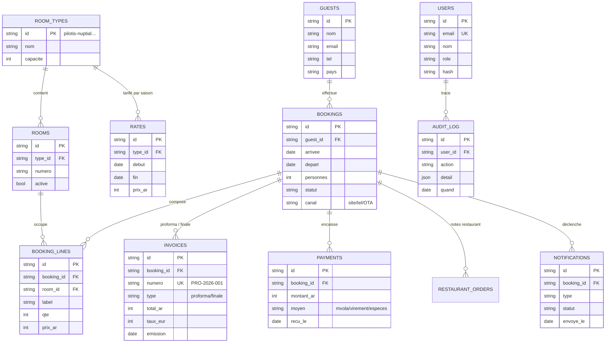

# Mini-PMS Lac Hôtel Sahambavy — Document d'architecture

**Phase 3 · Vision moyen terme · 16 juillet 2026 — document de cadrage, aucun code n'est engagé.**

Ce document décrit le système de gestion réservation / facturation / restaurant envisagé pour le Lac Hôtel : réservation directe en ligne par les clients, demande de proforma côté client **avec notification à l'hôtel à chaque demande**, et outils internes de suivi. Il capitalise sur l'existant livré en Phases 1-2 (site Next.js 16 sur Vercel, espace admin authentifié, moteur PDF proforma).

---

## 1 · Objectifs et périmètre

| Priorité | Fonction | Pour qui |
|---|---|---|
| P0 | Demande de réservation / proforma en ligne (dates, chambre, options) | Clients du site |
| P0 | **Notification immédiate à l'hôtel à chaque demande** (e-mail + tableau de bord) | Réception |
| P0 | Génération de proforma reliée aux demandes (1 clic, moteur Phase 2) | Réception |
| P1 | Planning d'occupation par chambre (calendrier interne) | Réception / direction |
| P1 | Suivi des statuts : demande → proforma envoyée → confirmée (acompte) → en séjour → soldée | Réception |
| P2 | Notes restaurant rattachées au séjour (additions simples) | Restaurant |
| P2 | Statistiques simples (taux d'occupation, CA par mois) | Direction |
| Hors périmètre v1 | Paiement en ligne par carte, channel manager OTA, comptabilité complète | — |

**Contrainte directrice** : l'équipe n'est pas technique et la connectivité à Sahambavy est irrégulière. Tout doit rester simple, en français, tolérant aux coupures (voir §8).

## 2 · Principes d'architecture

1. **Un seul repo, une seule plateforme** : le mini-PMS s'ajoute au site existant (Next.js App Router sur Vercel) — pas de deuxième système à héberger ni à apprendre.
2. **Réutiliser l'acquis** : Auth.js (Phase 2) étendu avec des rôles ; moteur PDF proforma (Phase 2) branché sur la base ; Resend (déjà câblé au formulaire de réservation) pour tous les e-mails.
3. **La base de données devient la source de vérité** (chambres, tarifs, réservations, factures) — les tarifs sortent du code.
4. **Coût de démarrage quasi nul**, montée en gamme uniquement si le volume le justifie (§7).

## 3 · Stack recommandée

| Couche | Choix | Pourquoi |
|---|---|---|
| Application | **Next.js 16 existant** (routes /api + Server Actions) | Zéro nouveau déploiement ; l'admin Phase 2 s'étend |
| Base de données | **PostgreSQL managé — Neon** (serverless, branche de dev gratuite) | Gratuit au départ, sauvegardes, SQL standard, s'endort entre les requêtes (trafic hôtel = faible) |
| ORM | **Prisma** | Migrations versionnées, types TypeScript générés, standard de fait |
| Authentification | **Auth.js v5 (en place)** + table `users` en base avec rôles `direction / reception / restaurant` | Continuité Phase 2 ; on remplace l'env var par la table |
| E-mails | **Resend (en place)** — modèles React Email existants | Déjà intégré, 100 mails/jour gratuits |
| Notification hôtel | E-mail booking@ + badge temps réel dans l'admin ; **option WhatsApp** via lien wa.me pré-rempli (gratuit) ou API WhatsApp Business/Twilio (payant, v2) | L'équipe vit sur WhatsApp ; l'exigence « notification à chaque demande » est doublée e-mail + dashboard |
| PDF | **pdf-lib (Phase 2)** exécuté côté serveur, numérotation par **séquence en base** (fin du compteur localStorage) | Même rendu, numérotation fiable multi-postes |
| Paiements | v1 : acompte par virement / **Mobile Money (MVola, Orange Money) enregistré manuellement** ; v2 : passerelle si un acteur fiable est disponible à Madagascar | Pas de Stripe à Madagascar ; le manuel d'abord, l'automatisation ensuite |

**Alternative étudiée** : Supabase (Postgres + auth + storage intégrés). Pertinent si l'on souhaite le temps réel intégré, mais Auth.js est déjà en place et Neon est plus simple côté pur SQL. Décision réversible tant que Prisma fait l'abstraction.

## 4 · Modèle de données (schéma cible)

**Points structurants**
- `RATES` par période remplace les tarifs codés en dur : la direction change les prix 2027 sans développeur (écran admin dédié).
- `INVOICES.numero` = séquence PostgreSQL par année → numérotation **PRO-AAAA-NNN** fiable même à plusieurs postes (remplace le compteur localStorage de la Phase 2).
- Statuts de réservation (machine à états simple) : `demande` → `proforma_envoyee` → `confirmee` (acompte reçu) → `en_sejour` → `soldee`, avec `annulee` accessible de partout. Chaque transition est journalisée dans `AUDIT_LOG`.
- La disponibilité se calcule depuis `BOOKING_LINES` (pas de table de dispo à maintenir) ; des `availability_blocks` optionnels pour travaux/fermetures.

## 5 · Flux clés

### 5.1 Demande de réservation / proforma (client)
1. Le client choisit dates, type de chambre, options sur `/reservation` (le calendrier n'affiche que la disponibilité réelle).
2. À la soumission : création `BOOKINGS(statut=demande)` + `GUESTS` →
   **notifications immédiates** : e-mail à booking@lachotel.com (Resend), badge « nouvelle demande » dans l'admin, option message WhatsApp.
3. Le client reçoit un accusé e-mail avec récapitulatif (sans engagement).

### 5.2 Proforma (réception — objectif < 1 minute)
1. Dans l'admin, la demande arrive pré-remplie (dates, chambre, personnes → lignes calculées via `RATES`).
2. La réception ajuste (remise, suppléments), clique **Générer la proforma** : n° séquentiel, PDF logoté (moteur Phase 2), **envoi e-mail direct au client** via Resend, statut → `proforma_envoyee`.
3. Relance automatique optionnelle à J+5 sans réponse.

### 5.3 Confirmation
Acompte reçu (Mobile Money / virement) → la réception l'enregistre dans `PAYMENTS` → statut `confirmee` → e-mail de confirmation au client + blocage ferme du planning.

## 6 · Environnements et exploitation

- **Production** : Vercel (projet actuel) + Neon `main`. **Préversion** : branches Vercel + branche Neon jetable — le workflow Phase 1/2 reste inchangé.
- **Sauvegardes** : export SQL hebdomadaire automatisé (cron Vercel → stockage) en plus du point-in-time Neon.
- **GitHub Pages** (vitrine statique de secours) : ne porte ni l'admin ni le PMS — inchangé.
- **Observabilité** : logs Vercel + alerte e-mail sur échec de notification (une demande sans notification est le seul incident vraiment grave du système).

## 7 · Coûts prévisionnels

| Poste | Démarrage (v1) | Croisière (si volume) |
|---|---|---|
| Vercel | 0 $ (Hobby) — passer **Pro 20 $/mois** dès usage commercial soutenu | 20 $/mois |
| Neon Postgres | 0 $ (free 0,5 Go — largement suffisant) | 19 $/mois (Launch) si besoin |
| Resend | 0 $ (100 e-mails/jour) | 20 $/mois (50 k/mois) |
| WhatsApp Business API (option) | 0 $ (liens wa.me manuels) | ~15-30 $/mois via Twilio |
| Domaine lachotel.com | déjà possédé | — |
| **Total** | **≈ 0-20 $/mois** | **≈ 40-90 $/mois** |

**Mise en perspective** : une seule réservation directe de 3 nuits en Pilotis (≈ 220 €) économise ~15-25 % de commission OTA (~35-55 €) — le système se rentabilise à ~1-2 réservations directes par mois.

## 8 · Risques et mitigations

| Risque | Mitigation |
|---|---|
| Connectivité irrégulière à l'hôtel | Outil 100 % cloud consultable depuis mobile 4G ; les notifications arrivent sur e-mail/WhatsApp (déjà consultés au quotidien) ; le planning reste consultable en lecture hors-ligne (PWA, cache) |
| Adoption par l'équipe | Interface en français, mêmes écrans que la proforma Phase 2 déjà connue, doc d'une page par écran, formation d'une demi-journée |
| Surréservation (site + Booking.com en parallèle) | v1 : la réception reporte manuellement les résas OTA dans le planning (5 min/jour) ; v3 : channel manager (ex. Beds24, ~30 €/mois) si le volume le justifie |
| Données personnelles (clients UE → RGPD) | Minimisation (nom, e-mail, dates), mention de confidentialité, suppression sur demande, base UE (Neon Francfort), accès par rôles + journal d'audit |
| Dépendance à un prestataire | Postgres standard + Prisma : export SQL complet à tout moment ; aucun enfermement propriétaire |

## 9 · Feuille de route proposée

1. **V1 — « Demandes & proformas » (2-3 semaines de dev)** : base Neon + Prisma, écrans demandes, notifications e-mail/dashboard, proforma DB + envoi e-mail, planning simple, tarifs éditables. *Critère : plus aucune demande ne transite hors du système.*
2. **V2 — « Encaissements & restaurant » (2 semaines)** : paiements manuels (Mobile Money/virement), factures finales, notes restaurant par séjour, statistiques de base.
3. **V3 — « Ouverture » (à la demande)** : channel manager OTA, paiement en ligne si passerelle viable, application PWA installable pour la réception.

---

*Document établi le 16 juillet 2026 dans le cadre de la refonte « Glacier Express » (Phases 1-2 livrées : PR #47). Décisions à valider avant tout développement : choix Neon vs Supabase, activation WhatsApp Business, calendrier V1.*
